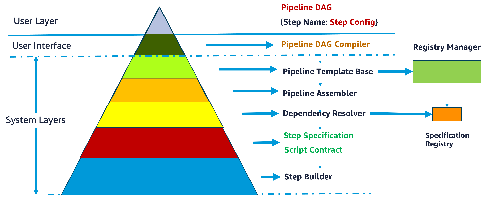

# Cursus Documentation Hub

Welcome to the comprehensive documentation for Cursus - an intelligent SageMaker pipeline generation system. This directory contains all the technical documentation, design specifications, examples, and development resources organized into logical sections.

## 📚 Documentation Structure

### 🛠️ [Developer Guide](0_developer_guide/README.md)
**Essential for contributors and developers extending Cursus**

Complete guide for developing new pipeline steps and extending the system:
- **[Getting Started](0_developer_guide/adding_new_pipeline_step.md)** - Main entry point for adding new pipeline steps
- **[Prerequisites](0_developer_guide/prerequisites.md)** - What you need before starting development
- **[Creation Process](0_developer_guide/creation_process.md)** - Step-by-step development process
- **[Component Guide](0_developer_guide/component_guide.md)** - Overview of key components and relationships
- **[Best Practices](0_developer_guide/best_practices.md)** - Recommended development practices
- **[Validation Checklist](0_developer_guide/validation_checklist.md)** - Comprehensive implementation validation
- **[Common Pitfalls](0_developer_guide/common_pitfalls.md)** - Mistakes to avoid

### 🏗️ [Design Documentation](1_design/README.md)
**Architectural insights and design decisions**

Comprehensive architectural documentation covering the sophisticated multi-layered design:
- **[Hybrid Design](1_design/hybrid_design.md)** - The implemented architecture combining specification and config-driven approaches
- **[Design Principles](1_design/design_principles.md)** - Core architectural philosophy and guidelines
- **[Specification-Driven Design](1_design/specification_driven_design.md)** - Declarative foundation for intelligent automation
- **[Dependency Resolver](1_design/dependency_resolver.md)** - Intelligent connection engine for automatic step wiring
- **[Smart Proxy](1_design/smart_proxy.md)** - Intelligent abstraction layer
- **[Fluent API](1_design/fluent_api.md)** - Natural language interface design

### 📋 [Project Planning](2_project_planning/)
**Implementation roadmaps and project evolution**

Detailed planning documents tracking the evolution and implementation of various system components:
- Implementation summaries and status updates
- Phase-based development plans
- Architectural evolution tracking
- Feature implementation roadmaps

### 🤖 [LLM Developer Resources](3_llm_developer/)
**AI-assisted development tools and templates**

Resources for using AI to assist with pipeline development:
- **Developer Demo**: Examples of AI-assisted development workflows
- **Prompt Templates**: Structured prompts for common development tasks
- **Notebook Digests**: AI-generated summaries of development notebooks

## 🔧 API Reference

### [Core Components](core/)
**Foundation layer components**

- **[Assembler](core/assembler/)** - Pipeline assembly and orchestration logic
- **[Compiler](core/compiler/)** - DAG to pipeline compilation
- **[Config Field](core/config_field/)** - Configuration field management
- **[Dependencies](core/deps/)** - Dependency resolution system

### [API Layer](api/)
**Public interfaces and abstractions**

- **[DAG](api/dag/)** - Pipeline DAG construction and manipulation APIs

### [Pipeline Steps](steps/)
**Complete step implementation ecosystem**

- **[Builders](steps/builders/)** - Step builder implementations
- **[Configs](steps/configs/)** - Step configuration classes
- **[Contracts](steps/contracts/)** - Script contract definitions
- **[Scripts](steps/scripts/)** - Processing script implementations
- **[Specs](steps/specs/)** - Step specification definitions

### [ML Components](ml/)
**Machine learning specific implementations**

Specialized components for various ML frameworks and use cases.

### [Test Suite](test/)
**Comprehensive testing framework**

Test implementations covering all system components with validation and integration tests.

## 📖 Examples and Usage

### [Pipeline Examples](examples/README.md)
**Ready-to-use pipeline blueprints**

Complete pipeline examples demonstrating various use cases:
- **[XGBoost End-to-End Pipeline](examples/mods_pipeline_xgboost_end_to_end.md)** - Complete ML workflow
- **[XGBoost Simple Pipeline](examples/mods_pipeline_xgboost_end_to_end_simple.md)** - Streamlined version
- **[PyTorch BSM Pipeline](examples/mods_pipeline_bsm_pytorch.md)** - Model deployment pipeline

## 🚀 Quick Start Paths

### For New Developers
1. Start with **[Developer Guide](0_developer_guide/README.md)** for comprehensive orientation
2. Review **[Prerequisites](0_developer_guide/prerequisites.md)** to ensure proper setup
3. Follow **[Creation Process](0_developer_guide/creation_process.md)** for step-by-step guidance
4. Study **[Examples](examples/README.md)** to see complete implementations

### For Architects and System Designers
1. Begin with **[Design Documentation](1_design/README.md)** for architectural overview
2. Study **[Design Principles](1_design/design_principles.md)** for philosophical foundation
3. Explore **[Hybrid Design](1_design/hybrid_design.md)** for implementation approach
4. Review **[Project Planning](2_project_planning/)** for evolution context

### For API Users
1. Explore **[API Reference](#-api-reference)** sections for component details
2. Check **[Examples](examples/README.md)** for usage patterns
3. Reference **[Core Components](core/)** for foundation understanding

### For Contributors
1. Read **[Developer Guide](0_developer_guide/README.md)** thoroughly
2. Follow **[Best Practices](0_developer_guide/best_practices.md)** guidelines
3. Use **[Validation Checklist](0_developer_guide/validation_checklist.md)** before submission
4. Consult **[Common Pitfalls](0_developer_guide/common_pitfalls.md)** to avoid issues

## 🏛️ Architecture Overview

Cursus implements a sophisticated layered architecture:



```
🎯 User Interface Layer
   ├── Fluent API (Natural language interface)
   └── Pipeline DAG (Graph construction)

🧠 Intelligence Layer  
   ├── Smart Proxies (Intelligent abstraction)
   └── Dependency Resolution (Automatic wiring)

🏗️ Orchestration Layer
   ├── Pipeline Assembler (Component coordination)
   └── Pipeline Compiler (DAG-to-template conversion)

📚 Registry Layer
   ├── Specification Registry (Step definitions)
   └── Registry Manager (Multi-context coordination)

🔧 Implementation Layer
   ├── Step Builders (SageMaker translation)
   ├── Step Specifications (Interface contracts)
   └── Configuration Management (Environment handling)

🏛️ Foundation Layer
   ├── Pipeline DAG (Topology modeling)
   └── Base Specifications (Type system)
```

## 🎯 Key Design Principles

1. **Declarative over Imperative** - Express intent, not implementation details
2. **Specification-Driven** - Rich specifications enable intelligent automation
3. **Layered Abstraction** - Clear separation of concerns across layers
4. **Progressive Disclosure** - Support users from beginners to experts
5. **Type Safety** - Comprehensive validation and error prevention
6. **Single Source of Truth** - Eliminate redundancy and inconsistency

## 📈 Benefits

### For Development Teams
- **10x Faster Development** - From weeks to minutes for pipeline creation
- **60% Code Reduction** - Intelligent automation eliminates boilerplate
- **Error Prevention** - Catch issues at design time, not runtime
- **Consistent Patterns** - Standardized approaches across all pipelines

### For Organizations
- **Accelerated Innovation** - Faster time-to-market for ML solutions
- **Reduced Technical Debt** - Clean architecture that scales
- **Built-in Governance** - Quality gates and compliance frameworks
- **Knowledge Sharing** - Self-documenting interfaces and patterns

## 🤝 Contributing

This documentation is a living resource that evolves with the system. To contribute:

1. **For Documentation Updates**: Follow the established patterns and structure
2. **For New Components**: Ensure comprehensive documentation in appropriate sections
3. **For Examples**: Provide complete, working examples with clear explanations
4. **For Design Changes**: Update both implementation and design documentation

See the **[Developer Guide](0_developer_guide/README.md)** for detailed contribution guidelines.

## 📞 Getting Help

- **Development Questions**: Consult **[Developer Guide](0_developer_guide/README.md)**
- **Architecture Questions**: Review **[Design Documentation](1_design/README.md)**
- **Usage Examples**: Check **[Examples](examples/README.md)**
- **Common Issues**: See **[Common Pitfalls](0_developer_guide/common_pitfalls.md)**

---

**Cursus Documentation Hub** - Your gateway to understanding and extending the intelligent SageMaker pipeline generation system. 🚀
